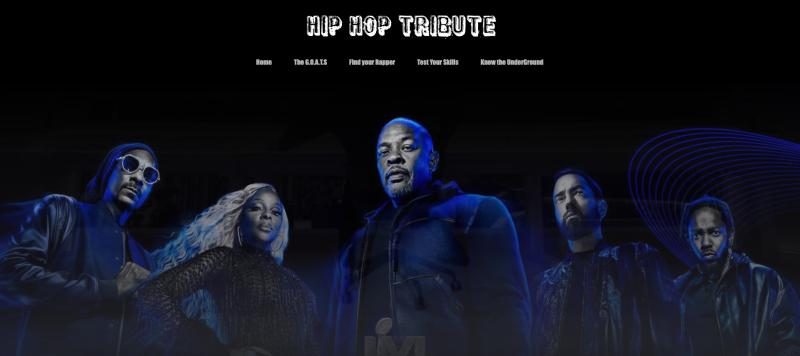
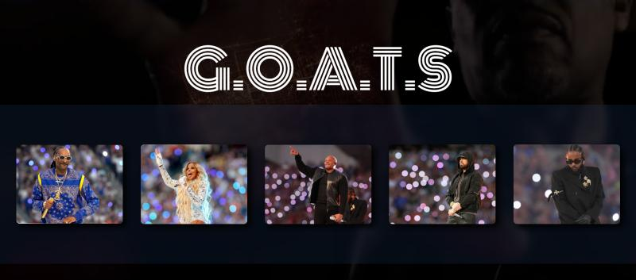
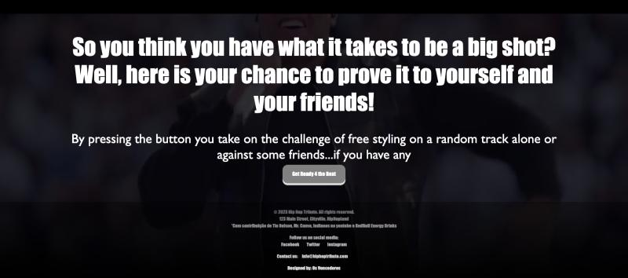

# 🎧 HipHopTribute

During the last week of the bootcamp Code For All, we were challenged with a 24-hour coding challenge, or Hackathon, to be performed in group.

As the bootcamp was reaching it's end, this was the perfect oportunity to put into practice the skills I've learned. 

 

## 🏆 And we won, by the way 🏆

The theme? The Superbowl Halftime Show. Our halftime? The 2022 one, with Dr. Dre, Snoop Dogg, Eminem, Mary J. Blidge and Kendrick Lamar. 
Ok but what to do with this? We had no limits to what we could do, as long as it was related to the show. So picking up the show, we noticed that the performance itself was a sort of tribute to the past (Dr. Dre, Snoop Dogg, Mary J. Blidge and Eminem) and present (Kendrick Lamar) generations of Hip Hop. And so this gave us the idea of continuing that tribute and building a website that would honor what Hip Hop was and what it can be. 

## Languages used
 

### Features
1. Find more about the artists that performed, like who they are, their discography and their impact on other renowned artists. 
2. Find out, through an interesting form, who's the artist, out of the 5 that performed, that you identify the most with.
3. Discover new upcoming artists.
4. Experience the Hip Hop culture by challenging someone for a battle, using our random beat button.

If you've seen the Halftime Show and want to know more, this is the place to be. 
 
 

## Media

https://github.com/ManuVils/HipHopTribute/assets/150291524/64b82690-a716-4b30-b939-9af5d6eeef7b

    
    
    

